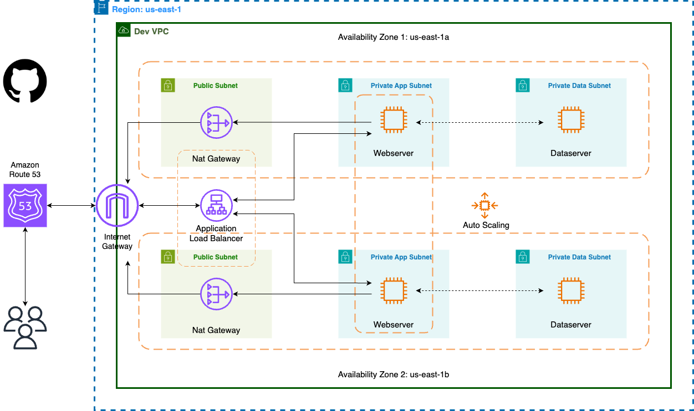

# AWS Static Website Deployment Project

## Overview
---
This project deploys a static HTML web application on AWS, leveraging various resources for high availability, fault tolerance, and scalability. The deployment utilizes Amazon EC2 instances, a Virtual Private Cloud (VPC) with public and private subnets across two availability zones, security groups, an Internet Gateway, and other AWS services.

## Architecture
---
1. **VPC Configuration:**
   - VPC with public and private subnets in two availability zones.
   - Internet Gateway for communication between instances in the VPC and the Internet.

2. **Security Groups:**
   - Firewalls controlling inbound and outbound traffic.

3. **Availability Zones:**
   - Two availability zones for high availability and fault tolerance.
   - Public subnets for resources like Nat Gateway, Bastion Host, and Application Load Balancer.

4. **EC2 Instances:**
   - Hosts the static website.
   - Distributed across availability zones using an Auto Scaling Group.
   - EC2 Instance Connect Endpoint simplifies resource connection.

5. **Internet Gateway:**
   - Enables communication between instances in the VPC and the Internet.

6. **Nat Gateway:**
   - Allows instances in private subnets to access the Internet.

7. **Auto Scaling Group:**
   - Dynamically creates EC2 instances for high availability, scalability, fault tolerance, and elasticity.

8. **Route 53:**
   - Used to register the domain name and create a record set for DNS resolution.

9. **GitHub Integration:**
   - Web files stored in GitHub for version control and collaborative development.

## Deployment Script
---
The deployment script automates the installation of the web app on an EC2 instance. Key steps include:

1. Updating the system and installing necessary packages.
2. Downloading the web app files from the GitHub repository.
3. Extracting and copying the files to the appropriate web server directory.
4. Enabling and starting the HTTP server.

### Deployment Script (Bash)
---
```bash
#!/bin/bash
sudo su
yum update -y
yum install -y httpd
cd /var/www/html
wget https://github.com/samuelcombey/website/raw/main/website.zip
unzip website.zip
cp -r /var/www/html/website-main/* /var/www/html
rm -rf website.zip website-main
systemctl enable httpd
systemctl start httpd
```
## Conclusion
---
This project successfully deploys a static website on AWS, utilizing various services and resources to achieve a robust and scalable architecture.
